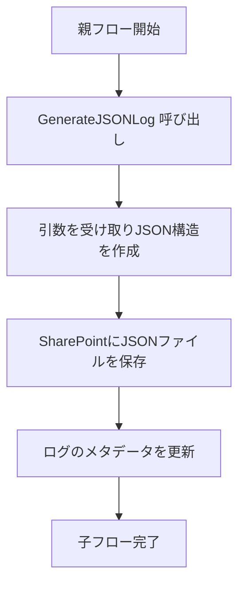

# Power Automate 子フロー ログ作成

# Flow name
`GenerateJSONLog`

## Content
このフローは、Power Automateでの各フロー実行時に発生したログをJSON形式で生成し、SharePointのドキュメントライブラリに保存

## Feature
1. フロー情報の記録: 実行中のフロー名、環境情報、トリガー種別を記録
2. アクションログの記録: 各アクションの実行開始時間、終了時間、ステータスを記録
3. ログ保存: JSON形式のログを生成し、SharePointに保存

## Usage
### Inputs

| 引数名         | 種類       | 説明                                         |
|--------------------|---------------|-------------------------------------------------|
| FlowName          | テキスト       | 親フローの名前。                                 |
| RunID             | テキスト       | 実行ごとの一意なID。                             |
| ExecutionDateTime | 日時           | 親フローの実行開始日時。                         |
| WorkflowData      | オブジェクト型 | `workflow` 関数から取得したフローの詳細情報。       |
| ActionResults     | 配列型         | `result` 関数から取得した各アクションの実行結果。   |
| ExecutedBy        | テキスト       | フローを実行したユーザーのメールアドレスまたはUPN。 |


| 引数名         | 種類       | 説明                                         |
|--------------------|---------------|-------------------------------------------------|
| FlowName          | テキスト       | 親フローの名前。                                 |
| RunID             | テキスト       | 実行ごとの一意なID。                             |
| ExecutionDateTime | 日時           | 親フローの実行開始日時。                         |
| WorkflowData      | オブジェクト型 | `workflow` 関数から取得したフローの詳細情報。       |
| ActionResults     | 配列型         | `result` 関数から取得した各アクションの実行結果。   |

### Outputs
1. JSONログファイル
   - ファイル名形式: `FlowLog_{RunID}.json`
   - 保存場所: SharePointの指定されたドキュメントライブラリ。

### Example
1. 親フローでの呼び出し
   親フロー内で `GenerateJSONLog` を呼び出し、必要な引数を設定します。

```json
{
  "FlowName": "Sample Parent Flow",
  "RunID": "a1b2c3d4-e5f6-7890-gh12-i3j4k5l6m7n8",
  "ExecutionDateTime": "2025-01-06T12:34:56Z",
  "WorkflowData": {
    "id": "/workflows/4b466fc61d994acc8a962da09abbd7df",
    "tags": {
      "flowDisplayName": "Log pattern",
      "environmentName": "2a9f4a58-fb85-e21f-b72e-f1240ba74eb0",
      "triggerType": "Instant",
      "state": "Enabled"
    }
  },
  "ActionResults": [
    {
      "name": "作成",
      "startTime": "2025-01-06T12:15:47.5077191Z",
      "endTime": "2025-01-06T12:15:47.5082089Z",
      "status": "Succeeded",
      "code": "OK"
    },
    {
      "name": "作成_parallel",
      "startTime": "2025-01-06T12:15:47.5354023Z",
      "endTime": "2025-01-06T12:15:47.5358414Z",
      "status": "Succeeded",
      "code": "OK"
    }
  ]
}
```

2. JSONログ生成の結果


```json
{
  "FlowName": "Log pattern",
  "RunID": "08584654411382593588998482279CU27",
  "Workflow": {
    "ID": "/workflows/4b466fc61d994acc8a962da09abbd7df",
    "FlowDisplayName": "Log pattern",
    "EnvironmentName": "2a9f4a58-fb85-e21f-b72e-f1240ba74eb0",
    "TriggerType": "Instant",
    "State": "Enabled"
  },
  "Actions": [
    {
      "Name": "作成",
      "StartTime": "2025-01-06T12:15:47.5077191Z",
      "EndTime": "2025-01-06T12:15:47.5082089Z",
      "Status": "Succeeded",
      "Code": "OK"
    },
    {
      "Name": "作成_parallel",
      "StartTime": "2025-01-06T12:15:47.5354023Z",
      "EndTime": "2025-01-06T12:15:47.5358414Z",
      "Status": "Succeeded",
      "Code": "OK"
    }
  ]
}
```

3. **マーメイド図: フローの流れ**
以下は、この子フローの実行を視覚化したマーメイド図です：



### **子フローの使い方**

1. **ソリューションに含める**
   - この子フローは、Power Automateのソリューションに追加してください。これにより、親フローからの再利用が可能になります。
   - ソリューションに含めることで接続参照の管理も容易になります。

2. **接続参照の利用**
   - SharePoint接続を子フローで使用する際は、ソリューション内で接続参照を設定してください

### **SharePointドキュメントライブラリの設定**

1. **メタデータの設定**

- 以下のカスタム列をドキュメントライブラリに追加してください：

| 列名               | 種類          | 説明                              |
|------------------|-------------|---------------------------------|
| FlowName         | テキスト      | フロー名を記録します。               |
| RunID            | テキスト      | 実行ごとの一意なIDを記録します。       |
| Status           | 選択肢       | 実行ステータス（成功/失敗など）を記録します。 |
| ExecutionDateTime | 日時         | 実行開始日時を記録します。            |

2. **アクセス権の設定**
   - 必要に応じて、ドキュメントライブラリへのアクセス権を制限し、適切なユーザーのみが閲覧および変更できるように設定してください。

3. **ライブラリの扱い方**
   - ログの整理が必要な場合、作成日時や実行ステータスでビューをカスタマイズして効率的に管理できます。
   - 定期的に古いログをアーカイブまたは削除して、ライブラリのパフォーマンスを維持してください。

### **注意事項**
- SharePoint ドキュメント ライブラリの適切な権限を設定してください。
- 親フローで `workflow` と `result` 関数を正しく使用して必要なデータを準備してください。
- 子フローの引数を親フローと整合性を持たせるように設計してください。

`Filter array` アクションを使用して、アクション結果にエラーが含まれているかどうかを判定する手順をREADMEに追記します。以下の修正案をご確認ください。

---

### **Filter array を利用したエラー検出**
#### **フィルター条件**
`Filter array` アクションで以下の条件を設定し、`ActionResults` 配列からエラーが発生しているアクションのみを抽出します。

- **条件**: 
  - `status` が `"Failed"` または `"Error"`
- **構成例**:
  ```plaintext
  item()?['status'] is equal to 'Failed' OR
  item()?['status'] is equal to 'Error'
  ```

#### **エラー存在の判定**
フィルター結果の配列の長さを `length()` 関数でチェックします：
- **条件式**:
  ```plaintext
  length(outputs('Filter_array')) > 0
  ```
  - 配列長が `0` より大きければ「エラーあり」と判定。

#### **メタデータ更新**
条件に応じて以下のようにメタデータを更新します：
- **エラーありの場合**: `Status = "エラーあり"`
- **エラーなしの場合**: `Status = "成功"`

# Deploy
[SharePoint に HTTP 要求を送信します](https://learn.microsoft.com/ja-jp/sharepoint/dev/business-apps/power-automate/guidance/working-with-send-sp-http-request)

https://learn.microsoft.com/ja-jp/sharepoint/dev/business-apps/power-automate/guidance/working-with-send-sp-http-request

```plaintext:uri
_api/v2.1/sites/root/lists
```

```json:Header
{
  "Content-Type": "application/json"
}
```

```json:Body
{
  "displayName": "JSON Log Repository",
  "columns": [
    {
      "name": "FlowName",
      "text": {
        "allowMultipleLines": false,
        "maxLength": 255
      }
    },
    {
      "name": "RunID",
      "text": {
        "allowMultipleLines": false,
        "maxLength": 255
      }
    },
    {
      "name": "Status",
      "choice": {
        "choices": ["Success", "Failure", "Pending"],
        "allowTextEntry": false
      }
    },
    {
      "name": "ExecutionDateTime",
      "dateTime": {}
    }
  ],
  "list": {
    "template": "documentLibrary"
  }
}
```